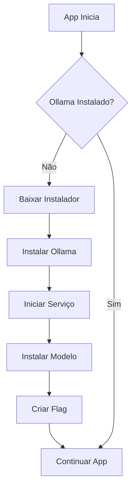
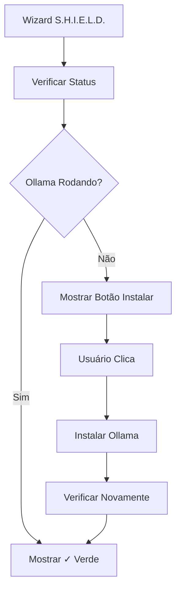

# 🤖 Ollama - Instalação Automática

## ✅ STATUS: INSTALAÇÃO AUTOMÁTICA IMPLEMENTADA

O Ultron agora instala o Ollama automaticamente na primeira execução!

---

## 🎯 Como Funciona

### 1. Primeira Execução

Quando você abre o Ultron pela primeira vez:

```
🔍 Verificando Ollama...
=== PRIMEIRA EXECUÇÃO: INSTALANDO OLLAMA ===

📥 Baixando instalador do Ollama...
✓ Download concluído

🚀 Executando instalador...
⚠️ Aguarde a instalação concluir...
✓ Ollama instalado com sucesso!

🚀 Iniciando Ollama...
⏳ Aguardando Ollama iniciar...
✓ Ollama iniciado com sucesso!

📦 Instalando modelo llama3.2:latest...
⚠️ Isso pode demorar alguns minutos (download de ~2GB)...
✓ Modelo instalado com sucesso!

=== INSTALAÇÃO CONCLUÍDA ===
✓ Ollama instalado e configurado
✓ Modelo llama3.2:latest instalado
✓ Serviço rodando em http://localhost:11434
```

### 2. Execuções Seguintes

Nas próximas vezes que você abrir o Ultron:

```
🔍 Verificando Ollama...
✓ Ollama já foi configurado anteriormente
```

O Ollama não será reinstalado, apenas verificado.

---

## 📦 O que é Instalado

### Windows

1. **Ollama.exe** em `%LOCALAPPDATA%\Programs\Ollama\`
2. **Serviço** configurado para iniciar automaticamente
3. **Modelo llama3.2:latest** (~2GB)

### macOS

1. **Ollama.app** em `/Applications/` (ou via Homebrew)
2. **Binário** em `/usr/local/bin/ollama`
3. **Modelo llama3.2:latest** (~2GB)

### Linux

1. **Binário** em `/usr/local/bin/ollama`
2. **Serviço systemd** (opcional)
3. **Modelo llama3.2:latest** (~2GB)

---

## 🛠️ Instalação Manual (Wizard)

Se a instalação automática falhar, você pode instalar manualmente pelo wizard:

### No Wizard (Etapa S.H.I.E.L.D.)

```
⚠️ Requisitos Obrigatórios:
● Ollama rodando localmente

🔴 ✗ Ollama não está instalado

[Instalar Ollama Automaticamente]
```

**Clique no botão** e aguarde:

```
⏳ Instalando Ollama...
(pode demorar alguns minutos)

✓ Ollama instalado com sucesso!
🟢 ✓ Ollama está rodando
```

---

## 🔍 Verificação de Status

### No Wizard

O wizard verifica automaticamente o status do Ollama:

- 🟢 **Verde**: Ollama está rodando
- 🟠 **Laranja**: Ollama instalado mas não está rodando
- 🔴 **Vermelho**: Ollama não está instalado

### No Chat

O painel do S.H.I.E.L.D. mostra o status:

```
🛡️ S.H.I.E.L.D.        ●

🟢 Ollama: Conectado

Ações: 0
Ameaças: 0
Bloqueadas: 0
```

---

## 📂 Arquivos Criados

### Script de Instalação

**Arquivo**: `install-ollama.cjs`

**Funcionalidades**:
- ✅ Detecta sistema operacional (Windows/Mac/Linux)
- ✅ Baixa instalador apropriado
- ✅ Instala Ollama silenciosamente
- ✅ Inicia serviço automaticamente
- ✅ Instala modelo llama3.2:latest
- ✅ Verifica instalação

### Flag de Instalação

**Arquivo**: `~/.openclaw/.ollama-installed`

Contém a data/hora da instalação. Usado para não reinstalar.

### Handlers IPC

**Arquivo**: `main.js`

**Handlers adicionados**:
- `install-ollama`: Instala Ollama manualmente
- `check-ollama-status`: Verifica status do Ollama

---

## 🚀 Fluxo de Instalação

### Automática (Primeira Execução)



### Manual (Wizard)



---

## ⚙️ Configuração

### Versão do Ollama

**Arquivo**: `install-ollama.cjs`

```javascript
const OLLAMA_VERSION = 'latest';
const OLLAMA_MODEL = 'llama3.2:latest';
```

Para usar versão específica:

```javascript
const OLLAMA_VERSION = '0.1.26';
const OLLAMA_MODEL = 'llama3.2:1b'; // Modelo menor
```

### Timeout de Instalação

```javascript
async waitForInstallation(maxWait = 60000) {
    // Aguarda até 60 segundos
}
```

### Timeout de Inicialização

```javascript
async waitForOllama(maxWait = 30000) {
    // Aguarda até 30 segundos
}
```

---

## 🐛 Troubleshooting

### Instalação Falha

**Problema**: Erro ao instalar Ollama

**Soluções**:

1. **Verificar permissões**:
```bash
# Windows: Executar como Administrador
# Linux/Mac: Usar sudo
```

2. **Verificar espaço em disco**:
```bash
# Necessário: ~3GB livres
```

3. **Verificar conexão com internet**:
```bash
# Download do instalador + modelo
```

4. **Instalar manualmente**:
```bash
# Baixar de: https://ollama.ai/download
```

### Ollama Não Inicia

**Problema**: Ollama instalado mas não inicia

**Soluções**:

1. **Iniciar manualmente**:
```bash
ollama serve
```

2. **Verificar porta**:
```bash
# Verificar se porta 11434 está livre
netstat -an | findstr 11434  # Windows
lsof -i :11434               # Linux/Mac
```

3. **Verificar logs**:
```bash
# Windows
%LOCALAPPDATA%\Ollama\logs\

# Linux/Mac
~/.ollama/logs/
```

### Modelo Não Instala

**Problema**: Erro ao instalar modelo

**Soluções**:

1. **Instalar manualmente**:
```bash
ollama pull llama3.2:latest
```

2. **Usar modelo menor**:
```bash
ollama pull llama3.2:1b  # ~1GB
```

3. **Verificar espaço**:
```bash
# Modelo completo: ~2GB
```

### Instalação Muito Lenta

**Problema**: Download demora muito

**Soluções**:

1. **Usar modelo menor**:
```bash
ollama pull llama3.2:1b
```

2. **Pausar e retomar**:
```bash
# Ollama retoma downloads automaticamente
```

3. **Verificar velocidade**:
```bash
# Download de ~2GB pode demorar 10-30 minutos
```

---

## 📊 Requisitos de Sistema

### Mínimos

- **RAM**: 8GB
- **Disco**: 5GB livres
- **CPU**: x64 (Intel/AMD)
- **Internet**: Para download inicial

### Recomendados

- **RAM**: 16GB
- **Disco**: 10GB livres
- **CPU**: x64 com AVX2
- **GPU**: Opcional (acelera inferência)

---

## 🎓 Comandos Úteis

### Verificar Instalação

```bash
ollama --version
```

### Listar Modelos

```bash
ollama list
```

### Testar Modelo

```bash
ollama run llama3.2:latest "Hello"
```

### Remover Modelo

```bash
ollama rm llama3.2:latest
```

### Parar Serviço

```bash
# Windows
taskkill /F /IM ollama.exe

# Linux/Mac
pkill ollama
```

### Iniciar Serviço

```bash
ollama serve
```

---

## 📚 Arquivos Modificados

### `install-ollama.cjs` (Novo)
- ✅ Classe `OllamaInstaller`
- ✅ Métodos de instalação por plataforma
- ✅ Download e instalação de modelo
- ✅ Verificação de status

### `main.js`
- ✅ Função `setupOllama()` - Instalação na primeira execução
- ✅ Handler `install-ollama` - Instalação manual
- ✅ Handler `check-ollama-status` - Verificação de status
- ✅ Chamada em `app.whenReady()`

### `renderer.js`
- ✅ Verificação de status no wizard
- ✅ Botão de instalação manual
- ✅ Indicador visual de status
- ✅ Atualização automática a cada 5s

---

## 🎉 Conclusão

O Ultron agora instala o Ollama automaticamente!

**Funcionalidades**:
- ✅ Instalação automática na primeira execução
- ✅ Botão de instalação manual no wizard
- ✅ Verificação de status em tempo real
- ✅ Instalação do modelo llama3.2:latest
- ✅ Inicialização automática do serviço
- ✅ Suporte para Windows, macOS e Linux

**Próximo passo**: Abra o Ultron e aguarde a instalação automática!

---

**Made with 🤖 for seamless AI integration**

Data: 10 de Fevereiro de 2025
